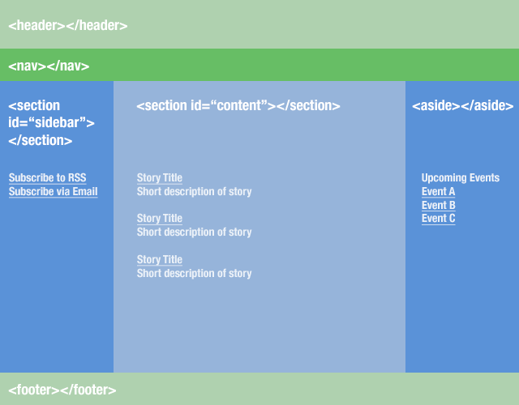

## What is aside tag? ##
A section can be used to group things together thematically. There are two ways to use section tags
- section tag inside article tag
- section tag outside article tag

## Example1 of aside tag ##
```html
 <body>
    <header>This is header</header>
    <nav>This is nav</nav>
    <article>
        <section>
            <h2>This is section></h2>
        </section>
    </article>
    <aside>This is aside</aside>
    <footer>This is footer</footer>

    <!-- JQuery needed for Bootstrap's JavaScript plugin -->
    <script src="https://ajax.googleapis.com/ajax/libs/jquery/1.12.4/jquery.min.js"></script>
    <!-- CDN Bootstrap min JavaScript-->
    <script src="https://maxcdn.bootstrapcdn.com/bootstrap/3.3.7/js/bootstrap.min.js"
        integrity="sha384-Tc5IQib027qvyjSMfHjOMaLkfuWVxZxUPnCJA7l2mCWNIpG9mGCD8wGNIcPD7Txa"
        crossorigin="anonymous"></script>
</body>
```


### Example2 of aside tag ###
```html
<body>
    <header>header</header>
    <nav>nav</nav>
    <section id="sidebar">
        <h2>Subscribe to RSS </h2>
        <h2>Subscribe via Email</h2>
    </section>
    <section id="content">
        <article>
            <h2>Story Title </h2>
            <p>Short description of Story</p>
        </article>

        <article>
            <h2>Story Title </h2>
            <p>Short description of Story</p>
        </article>

        <article>
            <h2>Story Title </h2>
            <p>Short description of Story</p>
        </article>
    </section>


    <aside>
        <article>
            <h2>Upcoming events</h2>
            <p>Event A</p>
            <p>Event B</p>
            <p>Event C</p>
        </article>
    </aside>

    <footer>
        This is footer
    </footer>

    <!-- JQuery needed for Bootstrap's JavaScript plugin -->
    <script src="https://ajax.googleapis.com/ajax/libs/jquery/1.12.4/jquery.min.js"></script>
    <!-- CDN Bootstrap min JavaScript-->
    <script src="https://maxcdn.bootstrapcdn.com/bootstrap/3.3.7/js/bootstrap.min.js"
        integrity="sha384-Tc5IQib027qvyjSMfHjOMaLkfuWVxZxUPnCJA7l2mCWNIpG9mGCD8wGNIcPD7Txa"
        crossorigin="anonymous"></script>
</body>

```



