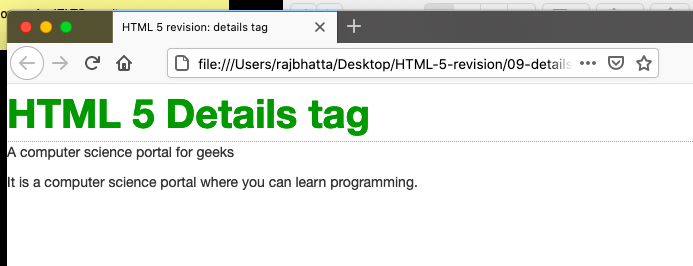

## What is details tag? ##
The details tag is used for the content/information which is initially hidden but could be displayed if the user wishes to see it. This tag is used to create an interactive widget which the user can open or close it. The content of the details tag is visible when open the set attributes

## Creating details  ##
```
<details>
    <summary>  Text content  </summary>
    <div> Content . . . >
</details>
```

## Example1 of datalist tag ##
```html
 <!DOCTYPE html>
<html lang="en">

<head>
    <meta charset="utf-8">
    <meta http-equiv="X-UA-Compatible" content="IE=edge">
    <meta name="viewport" content="width=device-width, initial-scale=1">
    <title>HTML 5 revision: details tag</title>
    <!-- CDN Bootstrap CSS -->
    <link rel="stylesheet" href="https://maxcdn.bootstrapcdn.com/bootstrap/3.3.7/css/bootstrap.min.css"
        integrity="sha384-BVYiiSIFeK1dGmJRAkycuHAHRg32OmUcww7on3RYdg4Va+PmSTsz/K68vbdEjh4u" crossorigin="anonymous">

    <style>
        summary {
            font-size: 40px;
            color: #090;
            font-weight: bold;
        }
    </style>

</head>

<body>
    <details>
        <summary>HTML 5 Details tag</summary>
        <p>A computer science portal for geeks</p>
        <div>It is a computer science portal where you
            can learn programming.</div>
    </details>
    <!-- JQuery needed for Bootstrap's JavaScript plugin -->
    <script src="https://ajax.googleapis.com/ajax/libs/jquery/1.12.4/jquery.min.js"></script>
    <!-- CDN Bootstrap min JavaScript-->
    <script src="https://maxcdn.bootstrapcdn.com/bootstrap/3.3.7/js/bootstrap.min.js"
        integrity="sha384-Tc5IQib027qvyjSMfHjOMaLkfuWVxZxUPnCJA7l2mCWNIpG9mGCD8wGNIcPD7Txa"
        crossorigin="anonymous"></script>
</body>

</html>
```


